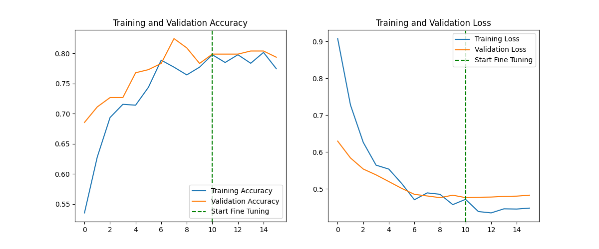
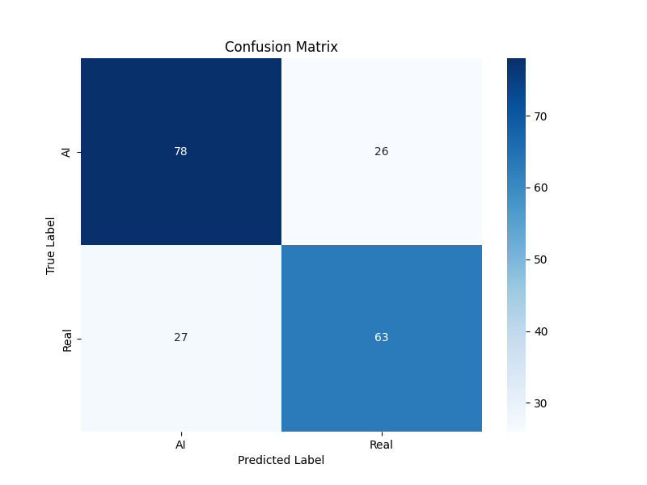
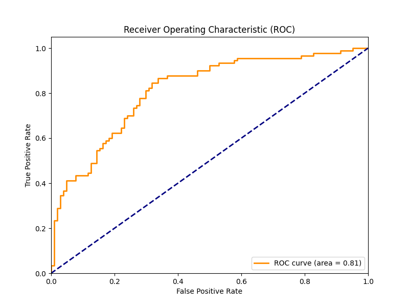

# 🖼️ AI vs Real Image Classifier


A powerful Deep Learning classifier designed to distinguish between **AI-generated** and **Real** images. This project utilizes **Transfer Learning** with **EfficientNetB0** to achieve high accuracy, featuring a two-phase training process (Frozen Base -> Fine-Tuning) and a user-friendly Web Interface.

---

## 📑 Table of Contents
- [Key Features](#-key-features)
- [Project Structure](#-project-structure)
- [Installation](#-installation)
- [Usage](#-usage)
  - [Training](#1-training)
  - [Evaluation](#2-evaluation)
  - [Prediction](#3-prediction)
  - [Web Application](#4-web-application)
- [Model Architecture](#-model-architecture)
- [Performance & Results](#-performance--results)

---

## 🌟 Key Features

- **Standard of the Art Model**: Built on `EfficientNetB0` for robust feature extraction.
- **Transfer Learning**: Implements a 2-stage training strategy (Feature Extraction + Fine-Tuning) for optimal performance.
- **Web Interface**: fully functional Flask-based Web App with Drag & Drop support.
- **Data Augmentation**: Auto-handling of image rotation, zoom, and contrast to prevent overfitting.
- **Visual Analytics**:
  - Live Training Curves (Loss/Accuracy)
  - Confusion Matrix
  - ROC Curve
- **Test Suite**: Built-in system to save and review manual test cases.

---

## 📂 Project Structure

```plaintext
.
├── Images/                 # Dataset folder (Real/ and AI/ subfolders)
├── classifier_project/     # Main Source Code
│   ├── app.py              # Flask Web Application entry point
│   ├── train.py            # Main training script (End-to-End)
│   ├── evaluate.py         # Generates Confusion Matrix & ROC plots
│   ├── predict.py          # CLI script for single image prediction
│   ├── requirements.txt    # Project dependencies
│   ├── best_model.keras    # Best saved model checkpoint
│   ├── final_model.keras   # Model saved after full training
│   ├── training_history.png # Graph of training accuracy/loss
│   ├── confusion_matrix.png # Model performance visualization
│   ├── roc_curve.png       # Receiver Operating Characteristic curve
│   ├── static/             # Web App assets (CSS, JS, Uploads)
│   └── templates/          # HTML templates for Web App
└── README.md               # Project Documentation
```

---

## 🚀 Installation

### 1. Prerequisite
Ensure you have **Python 3.9+** installed. We recommend using a virtual environment.

### 2. Setup Environment
```bash
# Create and activate conda environment (Recommended)
conda create -n aim python=3.9
conda activate aim
```

### 3. Install Dependencies
```bash
pip install -r classifier_project/requirements.txt
```
> **Note**: If `tensorflow` is already installed via Conda, you may ignore specific pip warnings.

---

## 💻 Usage

First, navigate to the project directory:
```bash
cd classifier_project
```

### 1. Training
Train the model from scratch. The script automatically handles data loading, augmentation, and the 2-stage training process.
```bash
python train.py
```
**Output**:
- Saves `best_model.keras` (Best Val Accuracy)
- Saves `final_model.keras` (After all epochs)
- Generates `training_history.png`

### 2. Evaluation
Generate performance metrics after training.
```bash
python evaluate.py
```
**Output**: 
- `confusion_matrix.png`
- `roc_curve.png`
- `classification_report.txt`

### 3. Prediction
Identify a single image via command line.
```bash
python predict.py ../Images/path/to/image.jpg
```

### 4. Web Application 🌐
Launch the graphical interface to interact with the model visually.
```bash
python app.py
```
Open your browser at: `http://127.0.0.1:8000`

**Web App Features**:
- **Home**: Drag & Drop images to classify instantly.
- **Deep Process**: Visualize backend logic (if implemented).
- **Test Examples**: View historical predictions and ground truths.
- **References**: View the latest training metrics directly in the browser.

---

## 🧠 Model Architecture

The solution uses **EfficientNetB0** pretrained on ImageNet as the backbone.

1. **Input Layer**: `(224, 224, 3)`
2. **Data Augmentation**: Random Flip, Rotation, Zoom, Contrast.
3. **Base Model**: `EfficientNetB0` (Frozen initially).
4. **Custom Head**:
   - `GlobalAveragePooling2D`
   - `BatchNormalization`
   - `Dropout(0.3)`
   - `Dense(1, activation='sigmoid')`

**Training Strategy**:
1. **Phase 1**: Train only the Custom Head (High Learning Rate `1e-3`).
2. **Phase 2**: Unfreeze Base Model & Fine-Tune (Low Learning Rate `1e-5`).

---

## 📊 Performance & Results

### Training History
Accuracy and Loss curves over epochs (Initial + Fine-Tuning phases).



### Confusion Matrix
Visual representation of True Positives, False Positives, etc.



### ROC Curve
Receiver Operating Characteristic curve showing the trade-off between TPR and FPR.



---
